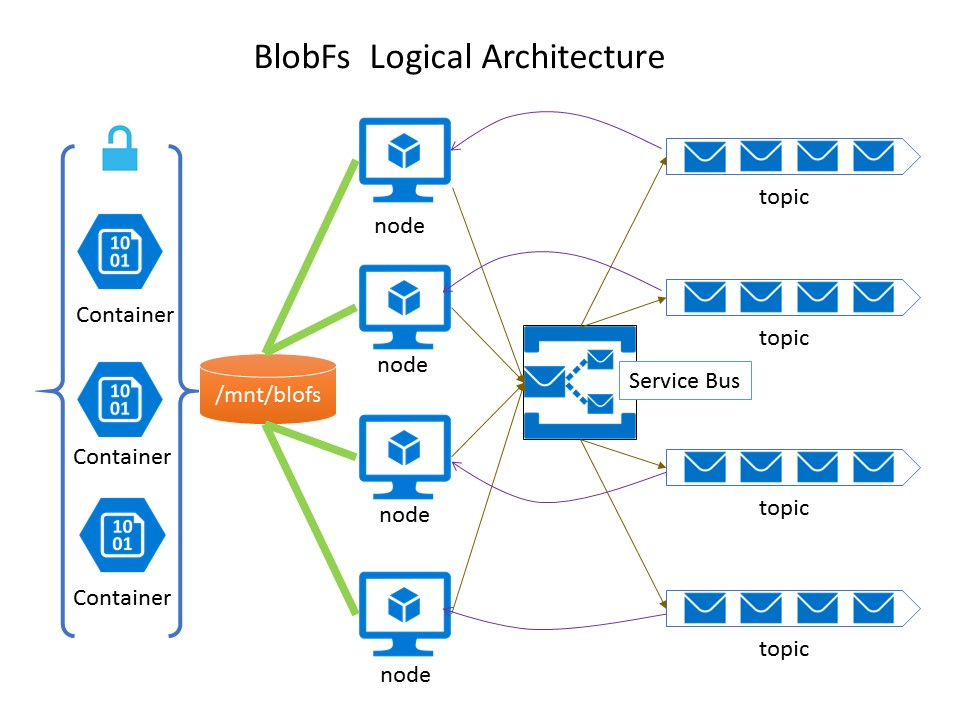

BlobFs
=====
BlobFs is a distributed [FUSE](http://fuse.sourceforge.net) based file system backed by [Microsoft azure blob storage service](https://azure.microsoft.com/en-us/services/storage/blobs/). It allows you to mount the containers/blobs in the storage account as a Linux local folder. It support the cluster mode.

## Project Goals
The main goal of the project is to make azure storage service easy to use for Linux box.

## Features:
* Implemented these fuse functions: getattr, readdir, open, release, read, flush, create, mkdir, rename, rmdir, unlink, truncate, write, symlink, readlink.
* Allow mount multiple containers (or part of them) as the local folder.
* Cluster enabled: It supports mount the same containers/blobs across multiple nodes. Theses files can be shared via these nodes. The caches of these nodes are synchronized via service bus.
* Use blob leases as the distributed locking mechanism across multiple nodes. The blob will be locked exclusively when it is written. 
* File’s attribute is cached for better performance, the cache are synchronized via service bus.
* The contents are pre-cached by chunks when there is read operation. This will eliminate the times of http request and increase the performance greatly. 
* Multi-part uploads are used for the write operation. Data is buffered firstly and then be uploaded if the buffer size exceed the threshold. This also can eliminate the times of http request and increase the performance greatly. 
* You can edit the file content on the fly, especially recommend for the small file, It does not need download, edit and then upload.
* Append mode is supported, you can append the new line to the existing blob directly. this is more friendly for logging operation. And it can change the block blob to append blob automatically.
* Use server-side copy for move, rename operations, more efficient for big files and folders.
* Support the link function

## Architecture and introduction

This is the logical architecture of blobfs:

* Blobfs uses the blob leases to safe the write operation in the distributed environment, there is a dedicated thread to renew the lease automatically.
* For each of the node, there is local cache in it’s memory, the cache will store the file attributes. Once the file is changed by the node, the node will send a message to the topic of the service bus. And then other nodes will receive the notification via the dedicated subscription of the topic.

## installation
I strongly recommend to test and verify it in you environment before you use it.
### 1.Install fuse
    yum group install "Development Tools"
    yum install fuse fuse-devel
### 2.Install blobfs without cluster mode enabled
#### 2.1 get the azure account connection string, refer this [link](https://docs.microsoft.com/en-us/azure/storage/storage-create-storage-account)
#### 2.2 Edit configuration file: 
	Open blobfs.conf
	change the setting of :
    Storage_Connection_String = your-storage-account -connection-string
    blob_prefix = /  (e.g. /container1/folder1/)
    mount_point = /mnt/blobfs (make sure the path exists in you node)
    cluster_enabled = false
You can also modify other settings if needed
### 3.Install blobfs with cluster mode enabled
Additionally, you should do these actions
#### 3.1 Create a service bus topic. Refer this [link](https://docs.microsoft.com/en-us/azure/service-bus-messaging/service-bus-create-topics-subscriptions)
#### 3.2 create a subscription for each of your node, refer this [link](https://docs.microsoft.com/en-us/azure/service-bus-messaging/service-bus-create-topics-subscriptions)
#### 3.3 Edit configuration file:
	Open blobfs.conf, 
	change the setting of :
    Storage_Connection_String = your-storage-account -connection-string
    blob_prefix = /  (e.g. /container1/folder1/) 
    mount_point = /mnt/blobfs (make sure the path exists in you node)
    cluster_enabled = true
    service_bus_connection_string = your-servicebus-connection-string
    service_bus_topic = your-blobfs-topic
    service_bus_subscription = subscription of the dedicated node
	You can modify other settings if needed
### final.Start the blobfs service
    nohup java -jar uber-blobfs-0.0.1-SNAPSHOT.jar

## Dependency
FUSE (Filesystem in Userspace) is an OS mechanism for unix-like OS that lets non-privileged users create their own file systems without editing kernel code.
[Java Native Runtime (JNR)](https://github.com/jnr/jnr-ffi) is high-performance Java API for binding native libraries and native memory.
[jnr-fuse](https://github.com/SerCeMan/jnr-fuse) is FUSE implementation in Java using Java Native Runtime (JNR).

## Limitation
* Due to the overhead of fuse system, the performance will be expected slower than native file system. 

## Supported platforms
-Linux : x86, x64
-MacOS (via osxfuse): x86, x64  (should be, but not tested yet)

## Command Line Usage
    blobfs  -h
    -b,--blob-prefix <arg>   The prefix of the blobs that will be used as the
                          mounted BlobFS root (e.g., /container1/blob1/;
                          defaults to /)
    -h,--help                Print this help
    -m,--mount-point <arg>   Desired local mount point for BlobFs.
    -o <arg>                 FUSE mount options

## License
	Copyright (C) 2017 Wesley Wu jie1975.wu@gmail.com
	This code is licensed under the The MIT License (MIT). 
	
## FeedBack
	Your feedbacks are highly appreciated! :)
